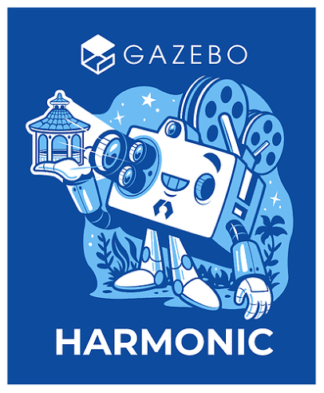
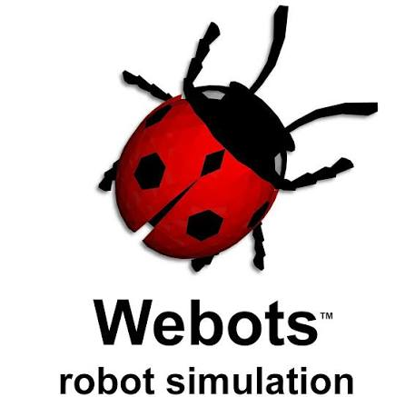
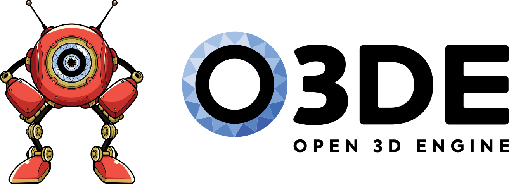
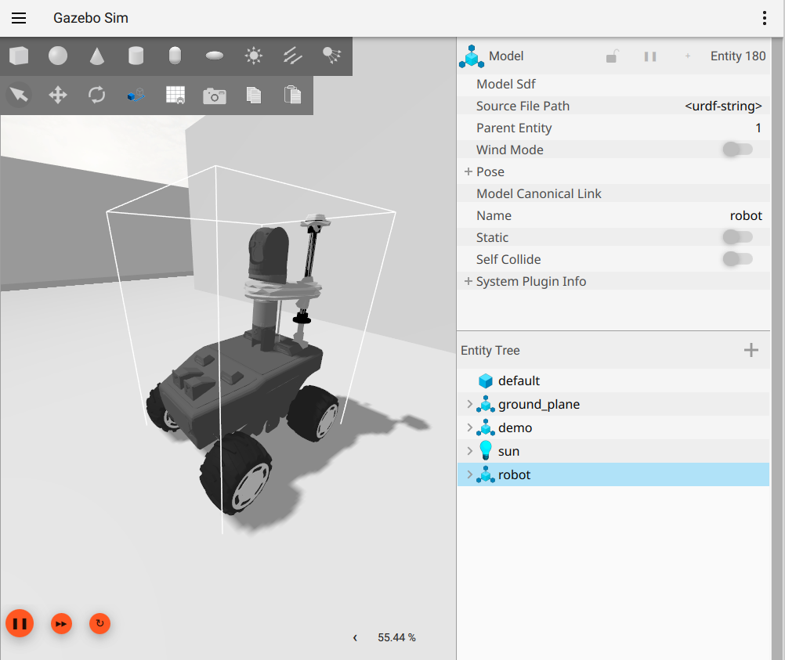
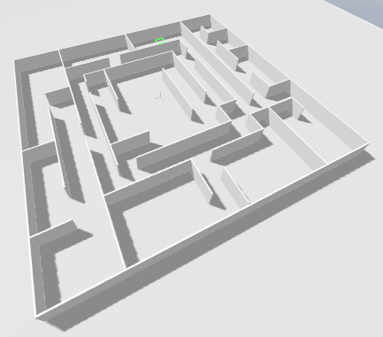

# Robotnik Simulation Benchmark

## 1. Introduction

`robotnik_sim_benchmark` is the reproducible integration repository for
comparing the same Robotnik robot workload in six simulation backends:
Gazebo Harmonic, Webots, NVIDIA Isaac Sim, MuJoCo, Open 3D Engine (O3DE), and
Unity.

The objective is not to declare a universally best simulator. It is to make
the trade-offs measurable and repeatable: the same robot model, worlds,
sensor profile, ROS 2 interfaces, scenario combinations, measurement periods,
and result format are used wherever the backend supports them. This makes the
repository useful for capacity planning, simulator selection, regression
tracking, and identifying differences between rendering, physics, and ROS 2
integration.

Simulation is important because it allows robotics teams to test many robots,
sensor configurations, environments, and failure cases before using physical
hardware. It also makes repeatable performance measurements possible and
reduces the cost and risk of validating changes.

Official simulator information:

| Logo | Simulator | Official information |
|---|---|---|
|  | Gazebo Harmonic | [Gazebo Harmonic documentation](https://gazebosim.org/docs/harmonic/) |
|  | Webots | [Cyberbotics Webots](https://cyberbotics.com/) |
|  | NVIDIA Isaac Sim | [Isaac Sim documentation](https://docs.isaacsim.omniverse.nvidia.com/latest/) |
|  | MuJoCo | [MuJoCo documentation](https://mujoco.readthedocs.io/) |
|  | O3DE | [O3DE documentation](https://docs.o3de.org/docs/) |
|  | Unity | [Unity for robotics](https://unity.com/solutions/robotics) |

### A quick visual overview

The benchmark uses the `rbwatcher` platform and the two reference worlds below.
These images are copied into the repository so the README remains useful even
when GitHub is rendering the project without following submodule file links.

<p align="center">
  
  
  
</p>

## 2. Benchmark approach

The benchmark asks one simple question: how does each simulator handle the
same robot workload?

Each backend receives the same scenario choices, robot count, interface
expectations, and measurement process. Only the launch adapter and the
backend-specific world or scene name change. This keeps the comparison easy
to understand while allowing each simulator to use its native ROS 2 bridge.

The experiment varies four things:

- world complexity: empty or simple;
- number of `rbwatcher` robots: one, two, or three;
- visualisation: GUI or headless, with RViz enabled or disabled.

The result combines system performance with ROS 2 observations. Backend
limitations are reported explicitly rather than hidden by changing the common
workload.

The source of truth is [`config/benchmark_config.yaml`](config/benchmark_config.yaml)
and the sensor contract is [`config/canonical_sensor_profile.yaml`](config/canonical_sensor_profile.yaml).

## 3. Scenario matrix

The current configuration contains 24 categories:

| Dimension | Values | Count |
|---|---|---:|
| World | `empty`, `simple` | 2 |
| Robot count | 1, 2, 3 | 3 |
| RViz | disabled, enabled | 2 |
| Execution mode | GUI, headless | 2 |
| **Total** | 2 × 3 × 2 × 2 | **24** |

Category names are generated from these dimensions. List them at any time with:

```bash
python3 scripts/validate/validate_config.py --category-names
```

## 4. Robot profile and benchmark observations

### Robot profile

The benchmark currently uses a fixed `rbwatcher` profile. The profile is
centralised in [`config/canonical_sensor_profile.yaml`](config/canonical_sensor_profile.yaml)
so that every adapter can be checked against the same intent. It includes two
cameras, a 16-channel 3D lidar, an IMU, a 50 Hz physics clock, and the
canonical ROS 2 QoS settings. These sensor and physics values are part of the
benchmark definition; they are not currently command-line parameters.

### Execution parameters

The following options are the practical parameters exposed by
`run_simulator_campaign.sh`:

The campaign script uses hyphenated long options. The lower-level
`run_benchmark.py` command accepts the equivalent timing options with the
existing underscore spelling shown by `python3 scripts/execute/run_benchmark.py --help`.

| Option | Default | Meaning |
|---|---|---|
| `--simulator`, `-s` | `webots` | Backend to run: Gazebo, Webots, Isaac Sim, MuJoCo, O3DE, or Unity |
| `--iterations`, `-n` | `1` | Number of repetitions per category |
| `--iteration-time`, `-t` | `60` s | Measurement time after startup |
| `--category` | all categories in campaigns | Exact category name or number `1`–`24` for `run_benchmark.py` |
| `--gui` | disabled | Select GUI categories only |
| `--headless` | disabled | Select headless categories only |
| `--rviz` | disabled | Select categories that include RViz |
| `--monitor-ros` | disabled | Collect per-topic ROS 2 transport statistics |
| `--process-monitor` | disabled | Open the live process monitor |
| `--render-fps` | `60` | GUI render cap from 1 to 1000 FPS |
| `--startup-timeout` | `120` s | Readiness timeout for configured image topics |
| `--warmup-time` | `0` s | Stabilisation time before measurement |
| `--max-retries` | `3` | Retries after a failed iteration |
| `--retry-cooldown` | `5` s | Pause before retrying |
| `--iteration-cooldown` | `5` s | Pause between iterations |
| `--cooldown` | `10` s | Pause between categories in a campaign |
| `--sigint-timeout` | `10` s | Cleanup grace period after SIGINT |
| `--sigterm-timeout` | `5` s | Cleanup grace period after SIGTERM |
| `--final-cleanup-timeout` | `30` s | Bounded final cleanup before retrying |
| `--list-only` | disabled | Print the selected categories without launching |

### Observable results

Performance CSV files record simulator, timestamp, iteration, first-frame and
startup time, total iteration time, CPU mean usage, CPU core peak and
saturation, RAM, GPU utilisation, GPU memory utilisation, GPU temperature,
GPU power, GPU and memory clocks, real-time factor statistics, clock message
count, clock resets, clock gaps, image-topic rate, image payload rate, image
gaps, image message count, render FPS cap, and measured render FPS.

Optional ROS CSV files record simulator, category, timestamp, iteration, topic,
message type, publisher count, message count, topic rate, payload MiB/s, and
maximum message gap. These measurements help distinguish simulator workload
limitations from ROS 2 transport or bridge limitations.

## 5. Basic installation

The reference environment is Ubuntu with ROS 2 Jazzy. Install the common
tools first:

```bash
sudo apt update
sudo apt install git git-lfs build-essential cmake ninja-build python3-pip
sudo apt install ros-jazzy-desktop python3-colcon-common-extensions
git lfs install
```

Each backend has additional requirements. Install the simulator version and
GPU drivers required by its official documentation before building its
workspace. The two backends that are not self-contained ROS 2 workspaces have
the following pinned tool versions:

| Backend | Required external installation | Why it is needed |
|---|---|---|
| O3DE | O3DE `26.05` (`engine_version: 2.6.0`) | Generates and builds the O3DE project and its Editor/GameLauncher targets |
| Unity | Unity Editor `6000.1.14f1` | Required to regenerate the distributed Unity Players; the current repository does not include the Unity source project |

Isaac Sim also requires its own installation and a compatible NVIDIA GPU. A
machine can build the Unity ROS 2 wrapper with `colcon` without rebuilding the
Unity Editor project, but the Unity Player archives must still be verified and
must have been built with Unity `6000.1.14f1`.

The reproducible workspace is currently available on
`review/jazzy-2026`. Use that branch until the pending Pull Request is merged
into `main`:

```bash
git clone --branch review/jazzy-2026 \
  https://github.com/RobotnikAutomation/robotnik_sim_benchmark.git \
  ~/robotnik_sim_benchmark
cd ~/robotnik_sim_benchmark
./scripts/setup_workspace.sh
```

After the Pull Request is merged, the `--branch review/jazzy-2026` option can
be omitted when cloning from `main`.

Download Git LFS assets when required by Unity or O3DE:

```bash
./scripts/setup_workspace.sh --pull-lfs
```

The repository contains one workspace per backend:

```text
robotnik_sim_benchmark/
├── benchmarks/                         # Local results; ignored by Git
├── config/                             # Matrix and sensor contract
├── scripts/                            # Setup, build, execution, validation, reports
├── robotnik_benchmark_gazebo_ws/src/robotnik/
├── robotnik_benchmark_webots_ws/src/
├── robotnik_benchmark_isaac_ws/src/
├── robotnik_benchmark_mujoco_ws/src/
├── robotnik_benchmark_o3de_ws/src/
└── robotnik_benchmark_unity_ws/src/
```

All direct dependencies are declared in [`.gitmodules`](.gitmodules) and are
fixed to commits. The nested `robotnik_isaac_ros2_control` submodule is not
needed for this benchmark and is intentionally not part of the bootstrap
operation.

## 6. Building the workspaces

O3DE and Unity require external installations and preparation before their
ROS 2 workspaces can be built. Complete those two sections first. Then build
the ROS 2 workspaces from the repository root.

### O3DE-specific preparation

Install O3DE `26.05` before running any O3DE build command. This release is the
one declared compatible by the checked-in project metadata
(`engine_version: 2.6.0`). The engine is expected at `/opt/O3DE/26.05` by the
examples below, although `O3DE_HOME` may point to another installation of the
same version. Generated binaries are not stored in this repository.

Installation resources:

- [O3DE setup guide](https://docs.o3de.org/docs/welcome-guide/setup/)
- [Linux binary packages](https://o3debinaries.org/download/linux.html)
- [O3DE system requirements](https://docs.o3de.org/docs/welcome-guide/setup/requirements/)

```bash
cd ~/robotnik_sim_benchmark
export O3DE_HOME=/opt/O3DE/26.05
export O3DE_EXTRAS_HOME="$PWD/robotnik_benchmark_o3de_ws/src/o3de-extras"
export PROJECT_PATH="$PWD/robotnik_benchmark_o3de_ws/src/robotnik_o3de/project/robotnik_roscon25"

git -C "$O3DE_EXTRAS_HOME" lfs pull

(cd "$O3DE_HOME" && "$O3DE_HOME/scripts/o3de.sh" register --this-engine)
"$O3DE_HOME/scripts/o3de.sh" register --all-gems-path "$O3DE_EXTRAS_HOME/Gems"
"$O3DE_HOME/scripts/o3de.sh" register --all-templates-path "$O3DE_EXTRAS_HOME/Templates"

cd "$PROJECT_PATH"
cmake -B build/linux -G "Ninja Multi-Config" \
  -DLY_DISABLE_TEST_MODULES=ON \
  -DCMAKE_EXPORT_COMPILE_COMMANDS=ON \
  -DLY_STRIP_DEBUG_SYMBOLS=ON
cmake --build build/linux --config profile \
  --target robotnik_roscon25 Editor robotnik_roscon25.Assets robotnik_roscon25.GameLauncher

cd ~/robotnik_sim_benchmark
./scripts/build_workspace.sh o3de
```

The CMake commands generate and build the O3DE project and its assets. The
final script command compiles only the `robotnik_common` and `robotnik_o3de`
ROS 2 wrapper packages. The `o3de-extras` checkout is not compiled with
`colcon`.

### Unity-specific preparation

Install Unity Editor `6000.1.14f1` before regenerating or rebuilding Unity
Players. This exact version is enforced by
`robotnik_unity/utils/verify_unity_archives.py` and is recorded in the metadata
inside the distributed archives.

Installation resources:

- [Unity Hub installation](https://docs.unity3d.com/hub/manual/InstallHub.html)
- [Unity download archive](https://unity.com/releases/editor/archive)
- [Unity robotics overview](https://unity.com/solutions/robotics)

The Unity integration has two distinct parts:

- `ROS-TCP-Endpoint` and `unity_sim` are ROS 2 packages and are built with
  `colcon`.
- Unity Players are distributed as compressed archives in `robotnik_unity`;
  the complete Unity source project is not currently available as a submodule.
  Rebuilding those Players requires Unity Editor `6000.1.14f1` and is not
  performed by `colcon`.

The pinned `robotnik_unity` commit includes both validated Player archives.
They are stored directly in that repository because the fork does not accept
new Git LFS objects. The original Unity source project is still not included,
so regenerating the Players requires recovering that project, its assets, and
a reproducible build procedure using Unity `6000.1.14f1`.

After cloning the repository, verify the included Player archives and build
the ROS packages:

```bash
cd ~/robotnik_sim_benchmark
UNITY_REPO="$PWD/robotnik_benchmark_unity_ws/src/robotnik_unity"
git -C "$UNITY_REPO" lfs pull
python3 "$UNITY_REPO/utils/verify_unity_archives.py" \
  "$UNITY_REPO/worlds/unity_simulation.tar.gz" \
  "$UNITY_REPO/worlds/unity_simulation_only.tar.gz"
./scripts/build_workspace.sh unity
source robotnik_benchmark_unity_ws/install/setup.bash
```

The verification step must pass before running Unity benchmarks. It checks the
archive hashes, expected worlds, source revision, Player binary, and Unity
version. If the Unity source project becomes available in a future revision,
the Player build instructions must remain pinned to `6000.1.14f1`.

Launch Unity with the existing ROS 2 launch integration. If the Unity source
project is published later, it should be added as a separate submodule with
its Unity Editor version and Player-generation procedure documented here.

### Build the ROS 2 workspaces

After O3DE and Unity preparation has been completed, build only the backend
you need:

```bash
cd ~/robotnik_sim_benchmark
./scripts/build_workspace.sh o3de
./scripts/build_workspace.sh unity
./scripts/build_workspace.sh gazebo_harmonic
./scripts/build_workspace.sh webots
./scripts/build_workspace.sh isaac_sim
./scripts/build_workspace.sh mujoco
```

Build all backends in dependency order with:

```bash
cd ~/robotnik_sim_benchmark
./scripts/build_workspace.sh all
```

The script sources ROS 2 and builds each workspace independently. It does not
share `build/`, `install/`, or `log/` directories between simulators. The `all`
target assumes that the O3DE project has already been generated and compiled
with the CMake commands in the O3DE section. It only builds the ROS 2 wrapper
packages for O3DE:

```bash
cd ~/robotnik_sim_benchmark
./scripts/build_workspace.sh o3de
```

When running `all`, the O3DE project and its Gems are not rebuilt; only
`robotnik_common` and `robotnik_o3de` are compiled for the O3DE workspace.

## 7. Running each simulator

The normal entry point is the common campaign script. It selects the same
categories for every backend and applies the backend-specific launch adapter.

### Gazebo Harmonic

Install [Gazebo Harmonic](https://gazebosim.org/docs/harmonic/install/) and
follow the [Ubuntu installation guide](https://gazebosim.org/docs/harmonic/install_ubuntu/)
before building the ROS 2 workspace.

```bash
cd ~/robotnik_sim_benchmark
source robotnik_benchmark_gazebo_ws/install/setup.bash
./scripts/execute/run_simulator_campaign.sh --simulator gazebo_harmonic \
  --iterations 3 --iteration-time 60 --monitor-ros
```

Gazebo uses `robotnik_gazebo_ignition` and the configured world/spawn launch
files. Use `--headless` for the headless categories only or `--gui` for GUI
categories only.

### Webots

Install Webots using the [official Webots download and installation
instructions](https://cyberbotics.com/doc/guide/installation-procedure), then
make sure the Webots executable is available to the ROS 2 integration.

```bash
cd ~/robotnik_sim_benchmark
source robotnik_benchmark_webots_ws/install/setup.bash
./scripts/execute/run_simulator_campaign.sh --simulator webots \
  --iterations 3 --iteration-time 60 --monitor-ros
```

Webots uses its world files and `robotnik_webots` launch integration. Ensure
the Webots runtime is installed and discoverable before launching.

### NVIDIA Isaac Sim

Follow NVIDIA's [Isaac Sim installation guide](https://docs.isaacsim.omniverse.nvidia.com/latest/installation/index.html)
and check the [system requirements](https://docs.isaacsim.omniverse.nvidia.com/latest/installation/requirements.html)
before building this wrapper.

```bash
cd ~/robotnik_sim_benchmark
source robotnik_benchmark_isaac_ws/install/setup.bash
./scripts/execute/run_simulator_campaign.sh --simulator isaac_sim \
  --headless --iterations 3 --iteration-time 60 --monitor-ros
```

Isaac Sim must be installed separately and its environment must be available
before the ROS 2 wrapper is launched. Isaac receives USD world files and has
a longer shutdown grace period automatically configured by the campaign
script.

### MuJoCo

Install MuJoCo following the [official documentation](https://mujoco.readthedocs.io/en/stable/overview.html)
and the [Python installation instructions](https://mujoco.readthedocs.io/en/stable/python.html)
when Python bindings are needed.

```bash
cd ~/robotnik_sim_benchmark
source robotnik_benchmark_mujoco_ws/install/setup.bash
./scripts/execute/run_simulator_campaign.sh --simulator mujoco \
  --iterations 3 --iteration-time 60 --monitor-ros
```

MuJoCo uses `rbwatcher_benchmark.launch.py` and receives the common world,
robot-count, GUI, RViz, and render-FPS parameters through the ROS 2 launch
file.

### O3DE

Install O3DE `26.05` using the [official setup guide](https://docs.o3de.org/docs/welcome-guide/setup/)
and check its [system requirements](https://docs.o3de.org/docs/welcome-guide/setup/requirements/)
before preparing the generated project described above. Do not run the ROS 2
launch command until the Editor, assets, and GameLauncher targets have been
generated successfully.

Complete the O3DE preparation above, then run:

```bash
cd ~/robotnik_sim_benchmark
source robotnik_benchmark_o3de_ws/install/setup.bash
./scripts/execute/run_simulator_campaign.sh --simulator o3de \
  --iterations 3 --iteration-time 60 --monitor-ros
```

O3DE requires the generated Editor, asset, and GameLauncher targets before
the ROS wrapper can start. Its level names are mapped from the common world
names by `benchmark_config.yaml`.

### Unity

Install Unity Editor `6000.1.14f1` using the [Unity download archive](https://unity.com/releases/editor/archive)
and follow the [official Unity robotics overview](https://unity.com/solutions/robotics).
This repository currently uses distributed Player archives rather than a Unity
source project; verify those archives before launching the ROS 2 benchmark.

Complete the Unity archive verification above, then run:

```bash
cd ~/robotnik_sim_benchmark
source robotnik_benchmark_unity_ws/install/setup.bash
./scripts/execute/run_simulator_campaign.sh --simulator unity \
  --iterations 3 --iteration-time 60 --monitor-ros
```

Unity launches a distributed Player through the existing ROS 2 integration.
The archive and transport checks are therefore part of setup, not a second
source build of a Unity project.

### One category or all simulators

To inspect the selected categories without launching a simulator:

```bash
cd ~/robotnik_sim_benchmark
./scripts/execute/run_simulator_campaign.sh --simulator gazebo_harmonic --list-only
```

To run one exact category directly:

```bash
cd ~/robotnik_sim_benchmark
source /opt/ros/jazzy/setup.bash
source robotnik_benchmark_gazebo_ws/install/setup.bash
python3 scripts/execute/run_benchmark.py gazebo_harmonic \
  --category one_robot_empty_world_headless \
  --iterations 1 --iteration_time 10 --warmup-time 5 --monitor-ros
```

To run the complete cross-simulator campaign:

```bash
./scripts/execute/run_all_simulators.sh --iterations 3 --iteration-time 60
```

## 8. Reports and validation

Each run writes performance CSV files, metadata JSON, and optional ROS topic
CSV files below `benchmarks/`. Generate Markdown summaries with:

```bash
python3 scripts/report/performance_report.py \
  --benchmarks-dir benchmarks --output performance_report.md
python3 scripts/report/ros_report.py \
  --benchmarks-dir benchmarks --output ros_report.md
```

The generated reports contain grouped summaries by simulator, category, and
render-FPS cap. Keep raw CSV and JSON data with the report when results need
to be audited. Benchmark outputs, generated simulator projects, and all
`build/`, `install/`, and `log/` directories are ignored by Git.

Validate the repository before sharing results:

```bash
./scripts/validate_workspace.sh
python3 -m pytest -q scripts/tests
```

The validation checks submodule commits, expected packages, the 24-category
configuration, and repository hygiene. It does not replace a real simulator
run; each backend should be smoke-tested on the target machine.

## 9. Conclusion and contribution

This repository provides a common, inspectable basis for comparing robotics
simulators through ROS 2. Its value grows when scenarios, sensor mappings,
launch adapters, and measurements are kept aligned across backends.

Contributions are welcome: improve a simulator adapter, add a validated
scenario, clarify a limitation, improve the report, or contribute hardware
and reproducibility notes. Please include the exact host, simulator version,
submodule commits, configuration, and generated report data needed to repeat
the result. Small, documented improvements help keep the benchmark useful to
the whole robotics community.
